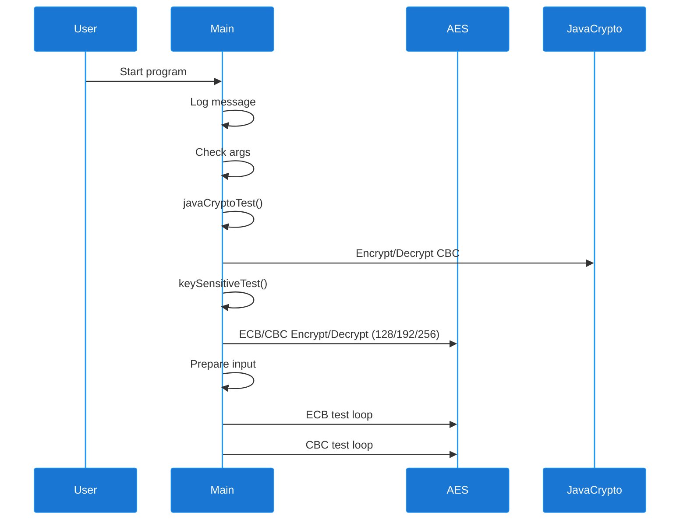

### Tiny AES in Java

This is a small and simple implementation of the AES ECB and CBC encryption algorithm written in Java.
You can use 128, 192 and 256 bit key. See the example in the `Main.java`.

### TODO

Optimization, refactor

### Jenkins Pipeline

This project includes a Jenkins pipeline for automated build and test:

- **Builds** the project using Maven (`mvn -B clean package`).
- **Runs JUnit tests** and collects reports from `**/surefire-reports/*.xml`.
- **Parameters** allow you to select actions (`REQUESTED_ACTION`, `REQUESTED_ACTION2`).
- **Conditional stages**: For example, if `REQUESTED_ACTION` is set to `greeting`, a greeting message is printed.
- **Groovy utility**: Loads and uses `jenkins/util.Groovy` for additional data and custom logic.

To use the pipeline, configure the parameters as needed in Jenkins and trigger the build. The pipeline automates compilation, testing, and reporting for the project.

## Sequence Diagram

